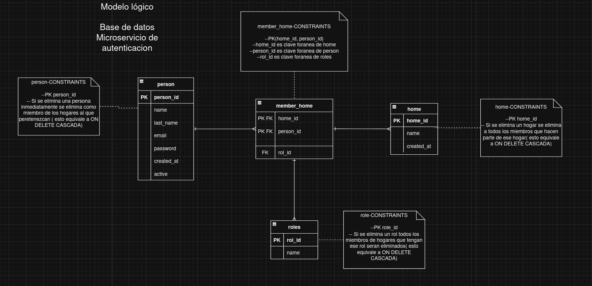
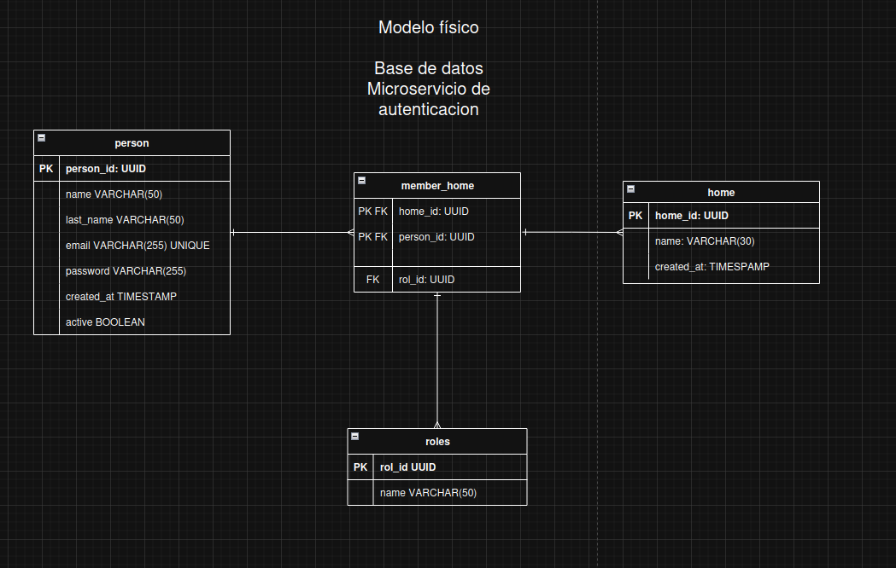
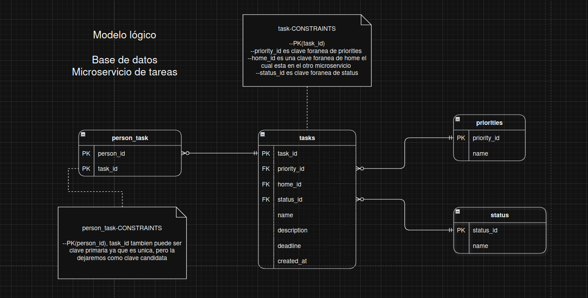
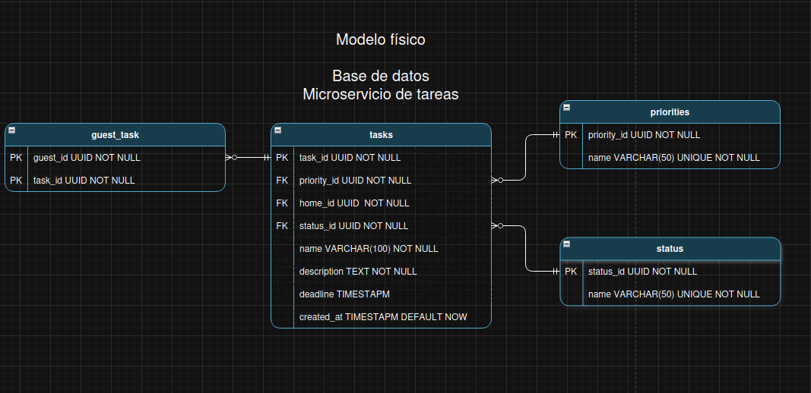

# Entregables Fabrica escuela primer sprint 

Nosotros debecrear una herramienta de gestion de tareas para grupos familiares

## Definición de las entidades 

### Microservicio de usuarios y autenticación
- **User**: Es la entidad que permitira la abstracción de todos los usaurio de sistema
- **Home**: Es la entidad que permitira la abstracción de los grupos familiares dentro de sistema
- **Role**: Es la entidad que permitira la clasificación de los usuarios por los roles dentro de dado grupo familiar.

### Microservicio de tareas
- **Task**: Es la entidad que permitira la abstracción de una tarea que estará asignada a un usuario dentro del contexto de un grupo familiar. 
- **Priority**: Es la entidad que permitirá la clasificación de las tareas según la prioridad que el administrador del grupo familiar.
- **Status**: Es la entidad que permitira la clasificacion de las tareas según el estado de realización que este tenga en dado momento.

## Modelos de Base de Datos

### Microservicio de Usuarios y Autenticación

**Modelo Lógico:**

**Modelo Físico:**

### Microservicio de Tareas

**Modelo Lógico:**

**Modelo Físico:**

