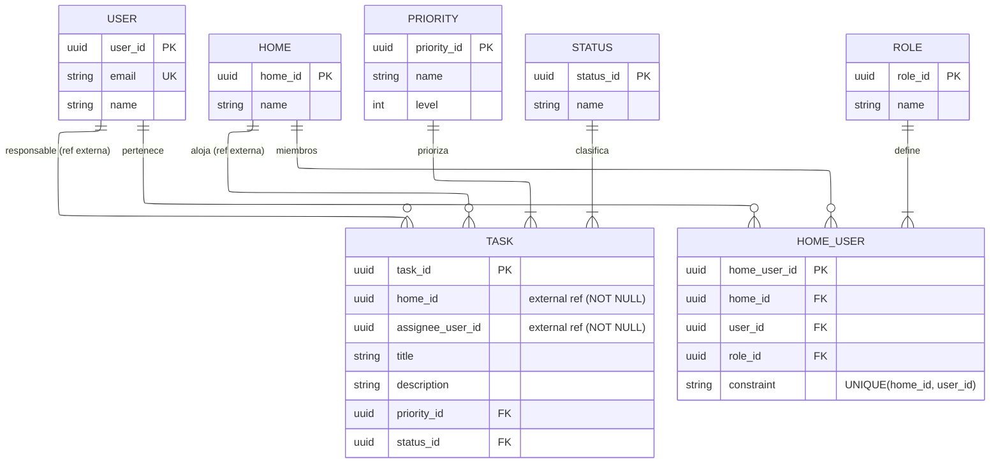

# Entregables Fabrica escuela primer sprint 

Nosotros debecrear una herramienta de gestion de tareas para grupos familiares

## Definición de las entidades 

### Microservicio de usuarios y autenticación
- **User**: Es la entidad que permitira la abstracción de todos los usaurio de sistema
- **Home**: Es la entidad que permitira la abstracción de los grupos familiares dentro de sistema
- **Role**: Es la entidad que permitira la clasificación de los usuarios por los roles dentro de dado grupo familiar.

### Microservicio de tareas
- **Task**: Es la entidad que permitira la abstracción de una tarea que estará asignada a un usuario dentro del contexto de un grupo familiar. 
- **Priority**: Es la entidad que permitirá la clasificación de las tareas según la prioridad que el administrador del grupo familiar.
- **Status**: Es la entidad que permitira la clasificacion de las tareas según el estado de realización que este tenga en dado momento.

## Preguntas y peticiones principales por modulo

### Modulo de usarios y autenticacion

- Como huesped de un grupo de familiar, quiero poder ver todas el nombre email y rol de las personas pertenecientes a mi mismo
grupo familiar con sus respectivos roles.

``` {sql}
SELECT p.name, p.email, r.name 
FROM person p 
  LEFT JOIN member_home mh ON p.person_id = mh.person_id 
  LEFT JOIN home h ON mh.home_id = h.home_id
  LEFT JOIN roles r ON mh.rol_id = r.rol_id
WHERE h.home_id = :home;
```

---

- Como usuario de la aplicación quiero ser capaz de ver todas los grupos familiares a los que estoy adscrito.

```{sql}
SELECT h.name FROM home
  LEFT JOIN member_home mh ON h.home_id = mh.home_id 
  LEFT JOIN person p ON mh.person_id = p.person_id
WHERE p.person_id = :person
```

---

- Como usuario no autenticado quiero ser capaz de verificar mi email y contraseña para hacer la autenticación en el sistema

```{sql}
SELECT email, password FROM persons 
WHERE email == :email AND password = :password
```

---

- Como usuario adscrito a un hogar quiero poder consultar mi perfil adscrito a dicho grupo familiar trayendo información como, mi nombre completo, mi email, nombre del grupo familiar y el rol que tengo en dicho hogar.

```{sql}
SELECT p.name, p.email, h.name, r.name
FROM person p 
  LEFT JOIN member_home mh ON p.person_id = mh.person_id 
  LEFT JOIN home h ON mh.home_id = h.home_id
  LEFT JOIN roles r ON mh.rol_id = r.rol_id
WHERE p.person_id = :person
```

---

- Como microservicio de tareas cuando un usuario ingrese una nueva tarea entregando el identificador del usuario y el grupo
familiar al cual se le asignará la tarea, Quiero poder consultar que el usuario exista y este adscrito a dicho hogar.

```{sql}
SELECT person_id, home_id 
FROM member_home 
WHERE person_id = :person_id AND home_id = :home_id
```

---

### Microservicio de tareas

- Como huesped de un grupo familiar quiero poder ver todas las tareas con titulo, descripcion, estado y prioridad que tengo asignada en dicho grupo de hogar.

```{sql}
SELECT t.name, t.descripton, s.name, p.name
FROM tasks t 
 LEFT JOIN guest_task gt ON t.task_id = gt.task_id
 LEFT JOIN stataus s ON t.status_id = s.status_id 
 LEFT JOIN priorities p ON t.priority_id = p.prority_id
WHERE gt.guest_id = :person
```

---

- Como huesped de un grupo familiar quiero poder ver todas las tareas con titulo descripcion, estado, prioridad y persona asignada de mi grupo familiar.

```{sql}
SELECT t.name, t.descripton, s.name, p.name
FROM tasks t 
 LEFT JOIN guest_task gt ON t.task_id = gt.task_id
 LEFT JOIN stataus s ON t.status_id = s.status_id 
 LEFT JOIN priorities p ON t.priority_id = p.prority_id
WHERE t.home_id = :home
```

---

- Como administrador de un grupo familiar querio poder ver todas las tareas con titulo, descripcion, estado, prioridad y peresona asignada del grupo familiar siendo capaz de filtrarlos, por persona asignada.

```{sql}
SELECT t.name, t.descripton, s.name, p.name
FROM tasks t 
 LEFT JOIN guest_task gt ON t.task_id = gt.task_id
 LEFT JOIN stataus s ON t.status_id = s.status_id 
 LEFT JOIN priorities p ON t.priority_id = p.prority_id
WHERE t.home_id = :home AND p.person_id = :person
```


## Modelos de Base de Datos

### Diagrama Entidad-Relación General



### Microservicio de Usuarios y Autenticación

**Modelo Lógico:**


**Modelo Físico:**


### Microservicio de Tareas

**Modelo Lógico:**


**Modelo Físico:**

