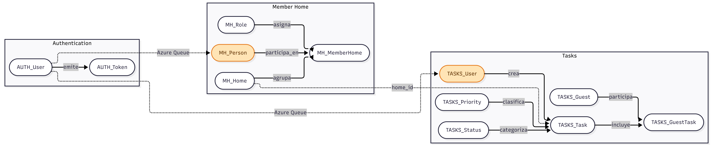

# Sprint 2 — Modelado de Datos por Microservicio

Este sprint contiene el modelado de base de datos de cada microservicio del sistema y un diagrama general de las relaciones entre ellos.

## Microservicios

| Microservicio | Schema | Carpeta |
|---|---|---|
| Authentication | `auth` | [microservicio-autenticacion/](./microservicio-autenticacion/) |
| Tasks | `task_management` | [microservicio_tareas/](./microservicio_tareas/) |

> El microservicio `user-membership-service` (schema `users`) se incluye en el diagrama general pero su modelado detallado se entregará por separado.

## Diagrama ER general de microservicios

Modela las entidades de cada microservicio y las conexiones entre ellos:

- **Relaciones internas** (línea continua): asociaciones dentro de un mismo servicio.
- **Conexiones entre microservicios** (línea punteada):
  - `AUTH_User → MH_Person` y `AUTH_User → TASKS_User`: sincronización de usuarios vía Azure Storage Queue.
  - `MH_Home → TASKS_Task`: referencia lógica por `home_id` (sin FK física, BDs separadas por schema).
- **Nodos en naranja** (`MH_Person`, `TASKS_User`): copias replicadas del `User` de Authentication.

