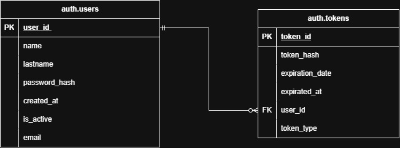
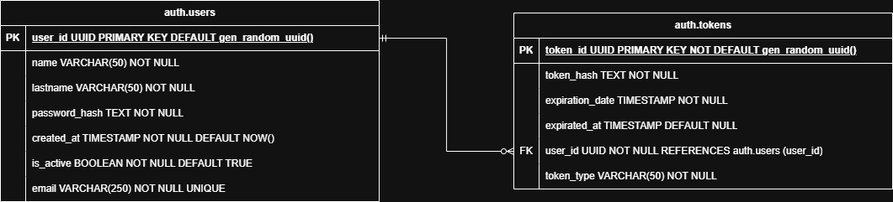

# Servicio de atenticacion

Este es el entregable de bases de datos para el microservicio de autenticacion.

## Modelo entidad relacion (nivel logico)



## Modelo de datos relacional (nivel fisico)



Para este microseravicio. Sera solamente necesaria dos tablas la de usuarios y la de tokens. La tabla de usarios se sincronizara con cada uno de los microservicios que tambien tengan la entidad usuarios en su dominio mediante una cola de mensajeria en azure.

## Scritp SQL que inicializa la base de datos
Como esta base la base de datos que sera usada para el programa sera la misma para todos los microservicios, se separan solo por `schemas`

```{sql}
DROP TABLE IF EXISTS auth.tokens;

DROP TABLE IF EXISTS auth.users;

DROP TYPE IF EXISTS auth.token_type;

CREATE SCHEMA IF NOT EXISTS auth;

CREATE TABLE IF NOT EXISTS auth.users (
    user_id UUID PRIMARY KEY DEFAULT gen_random_uuid (),
    name VARCHAR(50) NOT NULL,
    lastname VARCHAR(50) NOT NULL,
    password_hash TEXT NOT NULL,
    created_at TIMESTAMP NOT NULL DEFAULT NOW(),
    is_active BOOLEAN NOT NULL DEFAULT FALSE,
    email VARCHAR(255) NOT NULL UNIQUE
);

CREATE TABLE IF NOT EXISTS auth.tokens (
    token_id UUID PRIMARY KEY DEFAULT gen_random_uuid (),
    token_hash TEXT NOT NULL,
    expiration_date TIMESTAMP NOT NULL,
    expired_at TIMESTAMP DEFAULT NULL,
    user_id UUID NOT NULL REFERENCES auth.users (user_id),
    token_type VARCHAR(50) NOT NULL
)
```