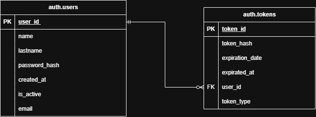
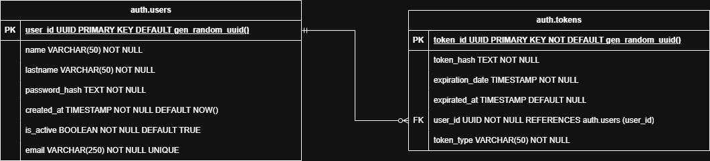

# Servicio de atenticacion

Este es el entregable de bases de datos para el microservicio de autenticacion.

## Modelo entidad relacion (nivel logico)



## Modelo de datos relacional (nivel fisico)



Para este microseravicio. Sera solamente necesaria dos tablas la de usuarios y la de tokens. La tabla de usarios se sincronizara con cada uno de los microservicios que tambien tengan la entidad usuarios en su dominio mediante una cola de mensajeria en azure.

## Scritp SQL que inicializa la base de datos
Como esta base la base de datos que sera usada para el programa sera la misma para todos los microservicios, se separan solo por `schemas`

```{sql}
DROP TABLE IF EXISTS auth.tokens;

DROP TABLE IF EXISTS auth.users;

DROP TYPE IF EXISTS auth.token_type;

CREATE SCHEMA IF NOT EXISTS auth;

CREATE TABLE IF NOT EXISTS auth.users (
    user_id UUID PRIMARY KEY DEFAULT gen_random_uuid (),
    name VARCHAR(50) NOT NULL,
    lastname VARCHAR(50) NOT NULL,
    password_hash TEXT NOT NULL,
    created_at TIMESTAMP NOT NULL DEFAULT NOW(),
    is_active BOOLEAN NOT NULL DEFAULT FALSE,
    email VARCHAR(255) NOT NULL UNIQUE
);

CREATE TABLE IF NOT EXISTS auth.tokens (
    token_id UUID PRIMARY KEY DEFAULT gen_random_uuid (),
    token_hash TEXT NOT NULL,
    expiration_date TIMESTAMP NOT NULL,
    expired_at TIMESTAMP DEFAULT NULL,
    user_id UUID NOT NULL REFERENCES auth.users (user_id),
    token_type VARCHAR(50) NOT NULL
)
```

## Consultas indentificadas segun el Sprint 1 y 2

1. Consultar un token por su hash (verificar autenticacion)

```{sql }
SELECT * FROM auth.tokens WHERE token_hash = :hash
```

2. Revocar todos los tokens de un usuario (logout)

```{sql}
UPDATE auth.tokens SET expirated_at = NOW() WHERE user_id = :userId
```

3. Crear un nuevo token login o register

```{sql}
INSERT INTO auth.tokens 
(token_hash, expiration_date, user_id, token_type) VALUES
(:tokenHash, :expriationDate, :userId, :tokenType)
```

## Volumen de datos aproximado por tablas

### Tabla de usuarios 

| Campo             | Tamaño aprox |
| ----------------- | ------------ |
| user_id           | 16 B         |
| name              | 30 B         |
| lastname          | 30 B         |
| password_hash     | 60 B         |
| created_at        | 8 B          |
| is_active         | 1 B          |
| email             | 50 B         |

En este caso ninguno de los datos puede ser nullos asi que no tenemos mapa de bits. En la tabla definimos aproximadamente el tamaño de cada uno de los tipos de datos
Campos de longitud variable: name, lastname, password_hash, email

$$
L = 4 \times \text{\# campos de longitud variable}
+ \sum \text{size(campos de longitud fija)}
+ \text{size(mapa de bits)}
+ \sum \text{tamaño estimado de cada campo de longitud variable}
\tag{1}
$$

$$
L=4 \times 4 +(16+8+1)+ (30+30+60+50) 
$$

$$
L = 211\  \text{bytes}
$$

Ahora calcula re el numero de regsitros por pagina, asumiendo que el tamaño de la pagina es de $4 KB$ es decir $4096\ \text{bytes}$1, y utilizando la siguente formula

$$
P = 1 + 1 + 4F_r + F_r L
$$
$$
4096 = 1 + 1 + 4F_r + 211 F_r
$$
$$
4094 = 215F_r
$$
$$
F_r = \frac{24094}{215} = 19.04 \approx 19\ \text{registros por paginas}
$$

Ahora calcularemos el numero de paginas que ocupa la relacion en el disco $B_r$, usando una estimacion de cuantas tuplas tendra la tabla en un año $T_r$. Usando la siguiente relacion:

$$
B_r = \frac{T_r}{F_r} 
$$

estimando que en un año habrán 1 millon de usuarios registrados en un año. 

$$
B_r = \frac{1 000 000}{19} = 52 631.578 \approx 52 632 \text{ paginas}
$$

Finalmente para saber cuanto espacio ocupa la relacion dentro del disco.

$$
size(Relacion) = B_r \times P = 52 632 \times 4KB = 2105360KB
$$

Asi que la relacion estara ocupando aproximadamente $2.10536GB$ dentro del disco

### Tabla de tokens

| Campo           | Tamaño |
| --------------- | ------ |
| token_id        | 16 B   |
| token_hash      | 60 B   |
| expiration_date | 8 B    |
| expired_at      | 8 B    |
| user_id         | 16 B   |
| token_type      | 20 B   |

Esta tabla tampoco adimitira solo admitira `expirated_at` como nulo. 
campos de longitud variable: token_hash, token_type

$$
L=4 \times 2 +(16+8+8+16)+(60+20)+1
$$

$$
L = 137B
$$

Calculare el $F_r$ usando la siguiente formula y asumiendo que $P=4096\ bytes$

$$
P = 1+1+4F_r +F_r L
$$

$$
4096 = 1+1+4F_r +137F_r
$$

$$
4094 = 141F_r
$$

$$
F_r = \frac{4094}{141} =29.03 \approx 29\ \text{registros por pagina}
$$

Ahora calculare el $B_r$  que es el numero de paginas que ocupa la relacion en disco, teniendo en cuenta que $T_r$ es el numero de tuplas que contiene la relacion. Estimando que dentro de un año se tendrán un 10 millones de tokens.

$$
B_r = \frac{T_r}{F_r} = \frac{10 000 000}{29} = 344 827.58 \approx 344 828\ \text{paginas}
$$

ahora para encontrar el tamaño total de la relacion en un año multiplico el peso de cada registro por el numero de registros por pagina y el numero total de paginas

$$
size(Relacion) = P  \times B_r
$$
p
teniendo en cuenta que $4096 = 4\times2^{10} = 4KB$

$$
size(Relacion) = 4KB \times 344 828 = 1379312KB \approx 1.315 GB
$$


