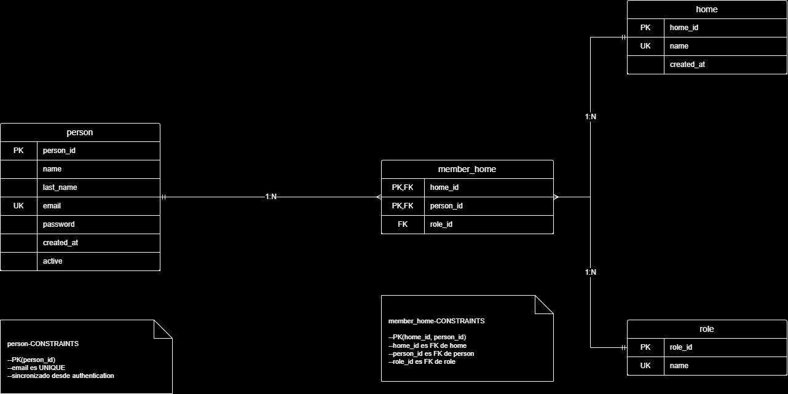
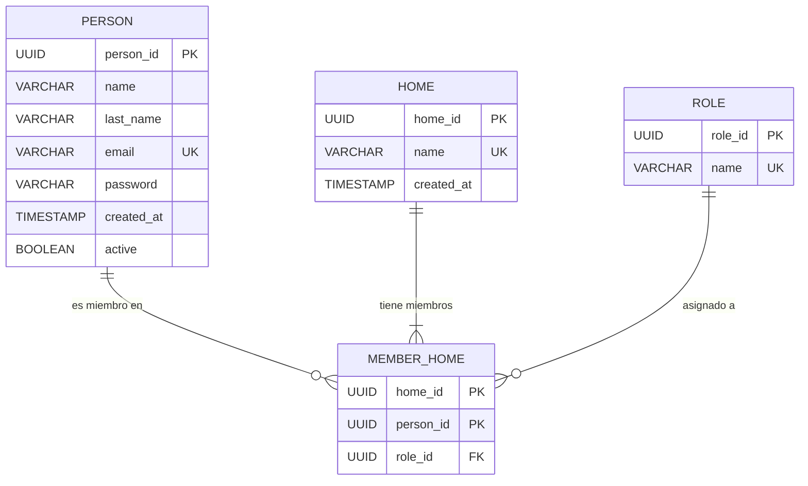
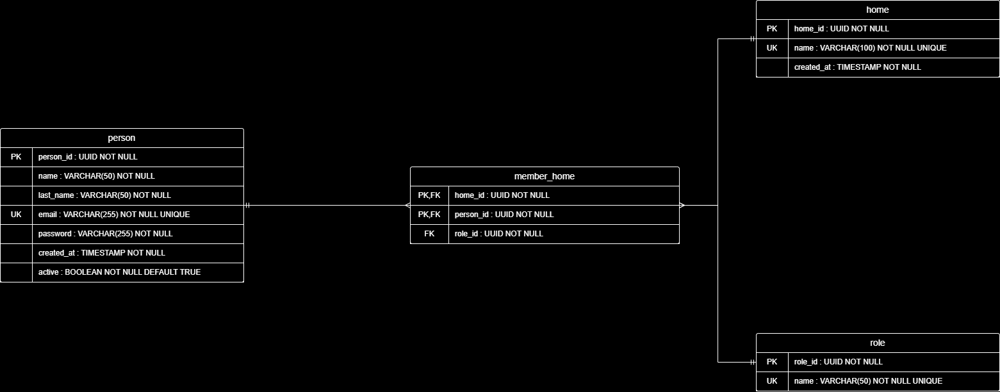

# Microservicio Miembros de Hogar — Entregable de Bases de Datos

Este es el entregable de bases de datos para el microservicio **user-membership-service** (Autheticator), encargado de la gestión de hogares, roles y la pertenencia de personas a un hogar.

> La entidad `person` es una réplica local sincronizada desde el microservicio `authentication` mediante una cola de Azure Storage Queue. Esa copia local permite enriquecer los DTOs de membresía sin acoplar este microservicio al schema `auth`.

---

## Modelo Entidad Relación (Nivel Lógico)





### Relaciones

| Entidad | Cardinalidad | Entidad |
|---------|:---:|---------|
| Person | 1 → N | MemberHome |
| Home   | 1 → N | MemberHome |
| Role   | 1 → N | MemberHome |
| Person | N → M | Home (a través de MemberHome) |

> Una persona puede pertenecer a 0 o muchos hogares. Un hogar debe tener al menos un miembro (el creador). Cada membresía tiene exactamente un rol; un mismo `(person_id, home_id)` no puede repetirse — la pareja es la clave primaria de la tabla asociativa.

---

## Modelo Físico



### `person` — Personas

Réplica local del usuario registrado en el microservicio de autenticación. Se mantiene sincronizada vía cola de mensajería.

| Atributo | Tipo | Descripción |
|---|---|---|
| `person_id`  | UUID         | Identificador único (mismo UUID que `auth.users.user_id`) |
| `name`       | VARCHAR(50)  | Nombre |
| `last_name`  | VARCHAR(50)  | Apellido |
| `email`      | VARCHAR(255) | Correo electrónico (UNIQUE) |
| `password`   | VARCHAR(255) | Hash BCrypt replicado |
| `created_at` | TIMESTAMP    | Fecha de creación |
| `active`     | BOOLEAN      | Indica si la cuenta está activa |

---

### `home` — Hogares

Representa cada núcleo familiar registrado en el sistema.

| Atributo | Tipo | Descripción |
|---|---|---|
| `home_id`    | UUID         | Identificador único |
| `name`       | VARCHAR(100) | Nombre del hogar (UNIQUE) |
| `created_at` | TIMESTAMP    | Fecha de creación |

---

### `roles` — Roles

Catálogo de roles que puede tener un miembro dentro de un hogar.

| Atributo | Tipo | Descripción |
|---|---|---|
| `role_id` | UUID        | Identificador único |
| `name`    | VARCHAR(50) | Nombre del rol (UNIQUE) — ej. `ADMIN`, `MEMBER` |

---

### `member_home` — Membresías

Tabla asociativa N:N entre `person` y `home`, con el rol como atributo de la asociación.

| Atributo | Tipo | Descripción |
|---|---|---|
| `home_id`   | UUID | FK → `home(home_id)` — parte de la PK compuesta |
| `person_id` | UUID | FK → `person(person_id)` — parte de la PK compuesta |
| `role_id`   | UUID | FK → `roles(role_id)` |

> **PK compuesta `(home_id, person_id)`** — garantiza que un usuario no aparezca dos veces en el mismo hogar.

---

## Script SQL que inicializa la base de datos

Como la base de datos es compartida entre los microservicios y se separan por `schemas`, todas las tablas de este microservicio viven bajo el schema `users`.

```sql
CREATE SCHEMA IF NOT EXISTS users;
CREATE EXTENSION IF NOT EXISTS pgcrypto;

CREATE TABLE IF NOT EXISTS users.person (
    person_id   UUID            PRIMARY KEY,
    name        VARCHAR(50)     NOT NULL,
    last_name   VARCHAR(50)     NOT NULL,
    email       VARCHAR(255)    NOT NULL UNIQUE,
    password    VARCHAR(255)    NOT NULL,
    created_at  TIMESTAMP       NOT NULL DEFAULT NOW(),
    active      BOOLEAN         NOT NULL DEFAULT TRUE
);

CREATE TABLE IF NOT EXISTS users.home (
    home_id     UUID            PRIMARY KEY DEFAULT gen_random_uuid(),
    name        VARCHAR(100)    NOT NULL UNIQUE,
    created_at  TIMESTAMP       NOT NULL DEFAULT NOW()
);

CREATE TABLE IF NOT EXISTS users.roles (
    role_id     UUID            PRIMARY KEY DEFAULT gen_random_uuid(),
    name        VARCHAR(50)     NOT NULL UNIQUE
);

CREATE TABLE IF NOT EXISTS users.member_home (
    home_id     UUID NOT NULL,
    person_id   UUID NOT NULL,
    role_id     UUID NOT NULL,
    PRIMARY KEY (home_id, person_id),
    FOREIGN KEY (home_id)   REFERENCES users.home(home_id)     ON UPDATE CASCADE ON DELETE CASCADE,
    FOREIGN KEY (person_id) REFERENCES users.person(person_id) ON UPDATE CASCADE ON DELETE CASCADE,
    FOREIGN KEY (role_id)   REFERENCES users.roles(role_id)    ON UPDATE CASCADE ON DELETE RESTRICT
);
```

---

## 🔍 Principales Consultas

### 1. Listar los miembros de un hogar con su rol

> Como **administrador**, quiero ver todos los miembros de mi hogar con su nombre, correo y rol asignado.

```sql
SELECT  p.person_id, p.name, p.last_name, p.email, r.name AS role
FROM    users.member_home mh
JOIN    users.person p ON p.person_id = mh.person_id
JOIN    users.roles  r ON r.role_id   = mh.role_id
WHERE   mh.home_id = :home;
```

---

### 2. Listar los hogares a los que pertenece una persona

> Como **miembro**, quiero ver los hogares en los que estoy registrado y mi rol en cada uno.

```sql
SELECT  h.home_id, h.name AS home, r.name AS role
FROM    users.member_home mh
JOIN    users.home  h ON h.home_id = mh.home_id
JOIN    users.roles r ON r.role_id = mh.role_id
WHERE   mh.person_id = :person;
```

---

### 3. Crear un nuevo hogar

> Como **usuario**, quiero registrar un hogar para luego asociar miembros.

```sql
INSERT INTO users.home (home_id, name, created_at)
VALUES (gen_random_uuid(), :name, NOW());
```

---

### 4. Asociar un nuevo miembro a un hogar

> Como **administrador**, quiero asociar a un usuario existente a mi hogar con un rol.

```sql
INSERT INTO users.member_home (home_id, person_id, role_id)
VALUES (:home, :person, :role);
```

---

### 5. Cambiar el rol de un miembro

> Como **administrador**, quiero cambiar el rol de un miembro dentro del hogar (publica `role_changed` en Service Bus).

```sql
UPDATE users.member_home
SET    role_id = :newRole
WHERE  home_id = :home AND person_id = :person;
```

---

### 6. Eliminar a un miembro de un hogar

> Como **administrador**, quiero remover a un miembro del hogar sin borrar su cuenta.

```sql
DELETE FROM users.member_home
WHERE  home_id = :home AND person_id = :person;
```

---

### 7. Eliminar un hogar y todas sus membresías

> Como **administrador**, quiero eliminar un hogar; las asociaciones se borran en cascada.

```sql
DELETE FROM users.home
WHERE  home_id = :home;
```

> 🔗 Gracias a la **eliminación en cascada** (`ON DELETE CASCADE`), las filas en `member_home` asociadas al hogar se eliminan automáticamente. Las personas y los roles se preservan.

---

### 8. Buscar un hogar por nombre

> Como **usuario**, quiero buscar un hogar específico por su nombre exacto.

```sql
SELECT  home_id, name, created_at
FROM    users.home
WHERE   name = :name;
```

---

## Volumen de Datos Estimado

### Tamaño por registro

#### `person`

| Campo | Tipo | Tamaño estimado |
|---|---|---|
| `person_id`  | Fijo (UUID)        | 16 bytes |
| `active`     | Fijo (BOOLEAN)     | 1 byte   |
| `created_at` | Fijo (TIMESTAMP)   | 8 bytes  |
| `name`       | Variable (VARCHAR) | 10 bytes |
| `last_name`  | Variable (VARCHAR) | 20 bytes |
| `email`      | Variable (VARCHAR) | 25 bytes |
| `password`   | Variable (VARCHAR) | 80 bytes |
| Mapa de bits | 7 columnas         | 1 byte   |

Campos de longitud variable: `name`, `last_name`, `email`, `password` (4 campos).

$$
L = 4 \times 4 + (10 + 20 + 25 + 80) + (16 + 1 + 8) + 1 = 177\ \text{bytes}
$$

Ahora se calculará el número de registros por página, asumiendo que el tamaño de la página es de $4 KB$ es decir $4096$ bytes, usando la siguiente fórmula:

$$
P = 1 + 1 + 4F_r + F_r L
$$
$$
4096 = 1 + 1 + 4F_r + 177 F_r
$$
$$
4094 = 181 F_r
$$
$$
F_r = \frac{4094}{181} = 22.6 \approx 22\ \text{registros por página}
$$

Estimando que en un año habrá 1 millón de personas registradas:

$$
B_r = \frac{T_r}{F_r} = \frac{1\,000\,000}{22} = 45\,454.5 \approx 45\,455\ \text{páginas}
$$

$$
size(\text{Relación}) = B_r \times P = 45\,455 \times 4KB = 181\,820 KB
$$

Es decir, aproximadamente $0.18 GB$ en disco.

---

#### `home`

| Campo | Tipo | Tamaño estimado |
|---|---|---|
| `home_id`    | Fijo (UUID)        | 16 bytes |
| `created_at` | Fijo (TIMESTAMP)   | 8 bytes  |
| `name`       | Variable (VARCHAR) | 20 bytes |
| Mapa de bits | 3 columnas         | 1 byte   |

Campos de longitud variable: `name` (1 campo).

$$
L = 4 \times 1 + 20 + (16 + 8) + 1 = 49\ \text{bytes}
$$

$$
P = 1 + 1 + 4F_r + 49 F_r
$$
$$
4094 = 53 F_r
$$
$$
F_r = \frac{4094}{53} = 77.24 \approx 77\ \text{registros por página}
$$

Asumiendo un promedio de 4 personas por hogar, con 1 millón de personas tendríamos aproximadamente $250\,000$ hogares:

$$
B_r = \frac{250\,000}{77} = 3\,246.7 \approx 3\,247\ \text{páginas}
$$

$$
size(\text{Relación}) = 3\,247 \times 4KB = 12\,988 KB \approx 0.013 GB
$$

---

#### `member_home`

| Campo | Tipo | Tamaño estimado |
|---|---|---|
| `home_id`   | Fijo (UUID) | 16 bytes |
| `person_id` | Fijo (UUID) | 16 bytes |
| `role_id`   | Fijo (UUID) | 16 bytes |
| Mapa de bits | 3 columnas | 1 byte   |

Sin campos de longitud variable, por lo cual no aplica el factor $4 \times N_{var}$:

$$
L = 0 + (16 + 16 + 16) + 1 = 49\ \text{bytes}
$$

$$
P = 1 + 1 + 4F_r + 49 F_r
$$
$$
4094 = 53 F_r
$$
$$
F_r = \frac{4094}{53} = 77.24 \approx 77\ \text{registros por página}
$$

Estimando que en promedio cada persona pertenece a 1 hogar, tendríamos $1\,000\,000$ membresías:

$$
B_r = \frac{1\,000\,000}{77} = 12\,987\ \text{páginas}
$$

$$
size(\text{Relación}) = 12\,987 \times 4KB = 51\,948 KB \approx 0.052 GB
$$

---

#### `roles`

| Campo | Tipo | Tamaño estimado |
|---|---|---|
| `role_id` | Fijo (UUID)        | 16 bytes |
| `name`    | Variable (VARCHAR) | 8 bytes  |
| Mapa de bits | 2 columnas      | 1 byte   |

$$
L = 4 \times 1 + 8 + 16 + 1 = 29\ \text{bytes}
$$

Debido al valor tan pequeño y a que el catálogo de roles tendrá apenas un puñado de filas (`ADMIN`, `MEMBER`, etc.), no se realiza la estimación en disco — el tamaño es despreciable.

---

### Proyección total anual (1.000.000 de usuarios)

| Tabla | Registros | Tamaño por registro | **Total** |
|---|---:|:---:|---:|
| `person`      | 1.000.000 | 177 bytes | **~0.18 GB**  |
| `home`        |   250.000 |  49 bytes | **~0.013 GB** |
| `member_home` | 1.000.000 |  49 bytes | **~0.052 GB** |
| `roles`       |        ~5 |  29 bytes | ~145 bytes    |

**Total aproximado del microservicio: ~0.245 GB / año** (≈ 245 MB).

A diferencia del microservicio de tareas, el crecimiento aquí es **lineal con el número de usuarios** (no exponencial con la actividad), por lo que el storage se mantiene controlado.
