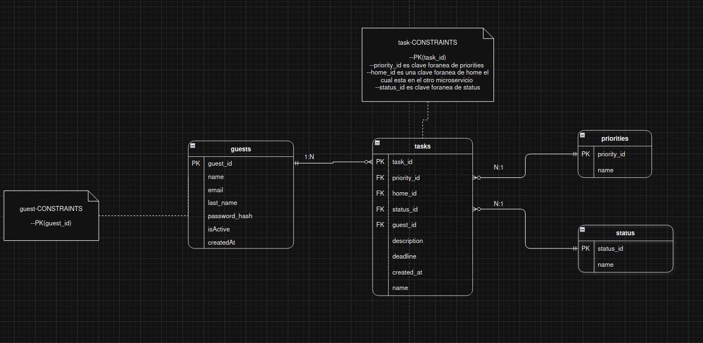
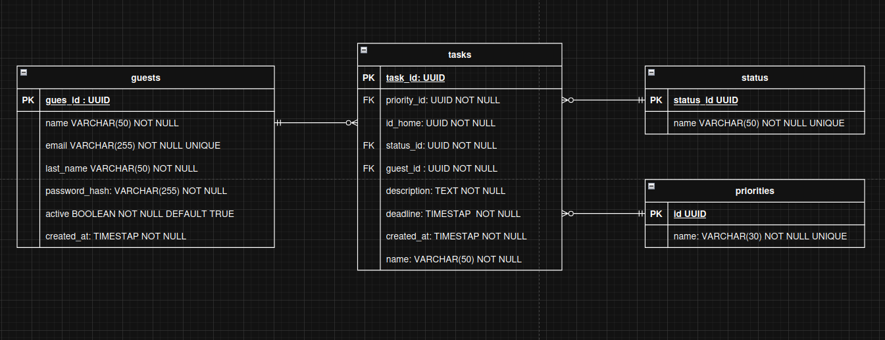

# Microservicio de tareas — Entregable de Bases de Datos

---

## Modelo Entidad Relación (Nivel Lógico)



### Relaciones

| Entidad | Cardinalidad | Entidad |
|---------|:---:|---------|
| Usuario | 1 → N | Tareas |
| Tarea | N → 1 | Prioridad |
| Tarea | N → 1 | Estado |
| Prioridad | 1 → N | Tareas |
| Estado | 1 → N | Tareas |

> Toda tarea debe tener un usuario asignado, pero los usuarios pueden existir sin tareas.

---

## Modelo Físico



### `guests` — Usuarios

Representa a las personas que usan el sistema.

| Atributo | Tipo | Descripción |
|---|---|---|
| `guest_id` | UUID | Identificador único |
| `name` | VARCHAR | Nombre del usuario |
| `last_name` | VARCHAR | Apellido del usuario |
| `email` | VARCHAR | Correo electrónico |
| `password_hash` | VARCHAR | Contraseña encriptada |
| `active` | BOOLEAN | Indica si el usuario está activo |
| `createdAt` | TIMESTAMP | Fecha de creación |

---

### `tasks` — Tareas

Representa las tareas creadas por los usuarios.

| Atributo | Tipo | Descripción |
|---|---|---|
| `task_id` | UUID | Identificador único |
| `name` | VARCHAR | Nombre de la tarea |
| `description` | TEXT | Descripción |
| `deadline` | TIMESTAMP | Fecha límite |
| `created_at` | TIMESTAMP | Fecha de creación |
| `guest_id` | UUID | Usuario propietario |
| `status_id` | UUID | Estado de la tarea |
| `priority_id` | UUID | Prioridad de la tarea |
| `id_home` | UUID | Referencia al microservicio de authenticator |

---

### `status` — Estado

Define el estado de una tarea. *Ejemplos: pendiente, en progreso, completada.*

| Atributo | Tipo | Descripción |
|---|---|---|
| `status_id` | UUID | Identificador único |
| `name` | VARCHAR | Nombre del estado |

---

### `priority` — Prioridad

Define el nivel de importancia de una tarea. *Ejemplos: alta, media, baja.*

| Atributo | Tipo | Descripción |
|---|---|---|
| `priority_id` | UUID | Identificador único |
| `name` | VARCHAR | Nombre de la prioridad |

---

## 🔍 Principales Consultas

### 1. Ver mis tareas asignadas en el grupo familiar

> Como **huésped**, quiero ver todas mis tareas con título, descripción, estado y prioridad.

```sql
SELECT  t.name, t.description, s.name AS status, p.name AS priority
FROM    task_management.task t
LEFT JOIN task_management.status   s ON t.status_id   = s.status_id
LEFT JOIN task_management.priority p ON t.priority_id = p.priority_id
WHERE   t.guest_id = :person;
```

---

### 2. Ver todas las tareas del grupo familiar

> Como **huésped**, quiero ver todas las tareas del hogar con título, descripción, estado, prioridad y persona asignada.

```sql
SELECT  t.name, t.description, s.name AS status, p.name AS priority, g.name
FROM    task_management.task t
LEFT JOIN task_management.guest    g ON t.guest_id    = g.guest_id
LEFT JOIN task_management.status   s ON t.status_id   = s.status_id
LEFT JOIN task_management.priority p ON t.priority_id = p.priority_id
WHERE   t.id_home = :home;
```

---

### 3. Filtrar tareas por persona asignada (admin)

> Como **administrador**, quiero ver las tareas del hogar filtrando por miembro asignado.

```sql
SELECT  t.name, t.description, s.name AS status, p.name AS priority
FROM    task_management.task t
LEFT JOIN task_management.status   s ON t.status_id   = s.status_id
LEFT JOIN task_management.priority p ON t.priority_id = p.priority_id
WHERE   t.id_home = :home AND t.guest_id = :person;
```

---

### 4. Crear una tarea y asignarla a un miembro

> Como **administrador**, quiero crear una tarea y asignarla a un miembro del hogar.

```sql
INSERT INTO task_management.task (
    task_id, name, description, deadline,
    created_at, guest_id, status_id, priority_id, id_home
)
VALUES (
    gen_random_uuid(),
    :name, :description, :deadline,
    :created_at, :guest_id, :status_id, :priority_id, :home
);
```

---

### 5. Actualizar una tarea

> Como **administrador**, quiero actualizar los datos de una tarea existente.

```sql
UPDATE task_management.task
SET
    name        = :name,
    description = :description,
    status_id   = :status_id,
    priority_id = :priority_id,
    deadline    = :deadline,
    guest_id    = :guest_id
WHERE task_id = :task_id;
```

---

### 6. Eliminar una tarea

> Como **administrador**, quiero eliminar una tarea del hogar.

```sql
DELETE FROM task_management.task
WHERE task_id = :task_id;
```

---

### 7. Eliminar un miembro y sus tareas

> Como **administrador**, quiero eliminar un miembro y todas sus tareas asociadas.

```sql
DELETE FROM task_management.guest
WHERE guest_id = :id;
```

> 🔗 Gracias a la **eliminación en cascada**, las tareas del miembro se eliminan automáticamente.

---

## Volumen de Datos Estimado

### Tamaño por registro

#### `guests`

| Campo | Tipo | Tamaño estimado |
|---|---|---|
| `guest_id` | Fijo (UUID) | 16 bytes |
| `active` | Fijo (BOOLEAN) | 1 byte |
| `created_at` | Fijo (TIMESTAMP) | 8 bytes |
| `email` | Variable (VARCHAR) | 25 bytes |
| `last_name` | Variable (VARCHAR) | 20 bytes |
| `name` | Variable (VARCHAR) | 10 bytes |
| `password_hash` | Variable (VARCHAR) | 80 bytes |
| Mapa de bits | 7 columnas | 1 byte |

**`L = (4 × 4) + (25 + 20 + 10 + 80) + (16 + 1 + 8) + 1 = 177 bytes`**

---

#### `tasks`

| Campo | Tipo | Tamaño estimado |
|---|---|---|
| `task_id` | Fijo (UUID) | 16 bytes |
| `priority_id` | Fijo (UUID) | 16 bytes |
| `id_home` | Fijo (UUID) | 16 bytes |
| `status_id` | Fijo (UUID) | 16 bytes |
| `guest_id` | Fijo (UUID) | 16 bytes |
| `deadline` | Fijo (TIMESTAMP) | 8 bytes |
| `created_at` | Fijo (TIMESTAMP) | 8 bytes |
| `description` | Variable (TEXT) | 100 bytes |
| `name` | Variable (VARCHAR) | 15 bytes |
| Mapa de bits | 9 columnas | 2 bytes |

**`L = (4 × 2) + (100 + 15) + (16×5 + 8×2) + 2 = 221 bytes`**

---

#### `status` y `priority`

| Campo | Tipo | Tamaño estimado |
|---|---|---|
| `id` | Fijo (UUID) | 16 bytes |
| `name` | Variable (VARCHAR) | 8 bytes |
| Mapa de bits | 2 columnas | 1 byte |

**`L = (4 × 1) + 8 + 16 + 1 = 29 bytes`**

---

### Proyección total (1.000.000 usuarios)

| Tabla | Registros | Tamaño por registro | **Total** |
|---|---:|:---:|---:|
| `guests` | 1.000.000 | 177 bytes | **~0.177 GB** |
| `tasks` | 30.000.000 | 221 bytes | **~6.63 GB** |
| `status` | 10 | 29 bytes | ~290 bytes |
| `priority` | 10 | 29 bytes | ~290 bytes |

> 📌 Asumiendo **1 tarea diaria por usuario**, cada mes se generan 30 millones de registros de tareas.