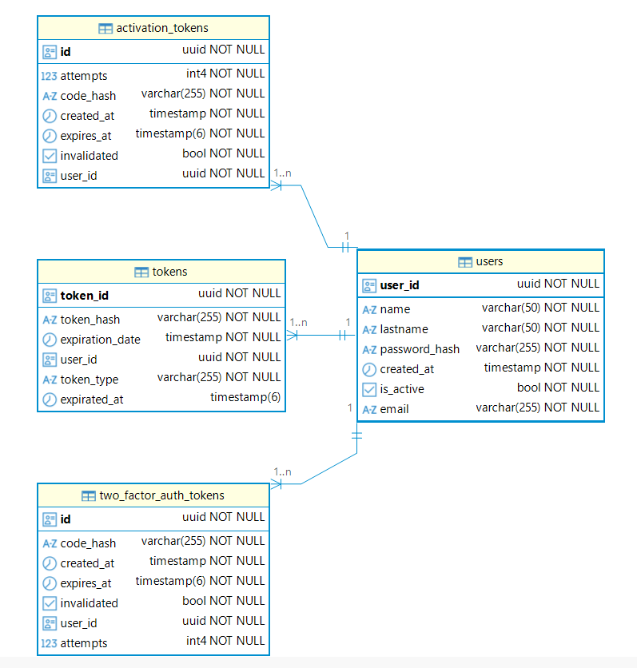

# Servicio de Autenticación

## Modelo relacional refinado del servicio 



## Script de creación de la base de datos

```sql
create table auth.tokens (
  expirated_at timestamp(6), 
  expiration_date timestamp(6) not null, 
  token_id uuid not null, 
  user_id uuid unique, 
  token_hash varchar(255) not null unique, 
  token_type varchar(255) not null check (
    (
      token_type in ('ACCESS', 'REFRESH')
    )
  ), 
  primary key (token_id)
);
create table auth.users (
  is_active boolean not null, 
  created_at timestamp(6) not null, 
  user_id uuid not null, 
  lastname varchar(50) not null, 
  name varchar(50) not null, 
  email varchar(255) not null unique, 
  password_hash varchar(255) not null, 
  primary key (user_id)
);
create table auth.activation_tokens (
  attempts INT DEFAULT 0 not null, 
  invalidated BOOLEAN DEFAULT FALSE not null, 
  created_at TIMESTAMP DEFAULT CURRENT_TIMESTAMP not null, 
  expires_at timestamp(6) not null, 
  id uuid not null, 
  user_id uuid not null, 
  code_hash varchar(255) not null, 
  primary key (id)
);
create table auth.tokens (
  expirated_at timestamp(6), 
  expiration_date timestamp(6) not null, 
  token_id uuid not null, 
  user_id uuid unique, 
  token_hash varchar(255) not null unique, 
  token_type varchar(255) not null check (
    (
      token_type in ('ACCESS', 'REFRESH')
    )
  ), 
  primary key (token_id)
);
create table auth.two_factor_auth_tokens (
  attempts INT DEFAULT 0 not null, 
  invalidated BOOLEAN DEFAULT FALSE not null, 
  created_at TIMESTAMP DEFAULT CURRENT_TIMESTAMP not null, 
  expires_at timestamp(6) not null, 
  id uuid not null, 
  user_id uuid not null, 
  code_hash varchar(255) not null, 
  primary key (id)
);
create table auth.users (
  is_active BOOLEAN DEFAULT FALSE not null, 
  created_at timestamp(6) not null, 
  user_id uuid not null, 
  lastname varchar(50) not null, 
  name varchar(50) not null, 
  email varchar(255) not null unique, 
  password_hash varchar(255) not null, 
  primary key (user_id)
);
alter table 
  if exists auth.activation_tokens 
add 
  constraint FKgtry5rof27b5hdur1a11y0gsn foreign key (user_id) references auth.users;
alter table 
  if exists auth.tokens 
add 
  constraint FK2dylsfo39lgjyqml2tbe0b0ss foreign key (user_id) references auth.users;
alter table 
  if exists auth.two_factor_auth_tokens 
add 
  constraint FKe7aqfopyjm7wfc0ohceqbsm2y foreign key (user_id) references auth.users;

```
